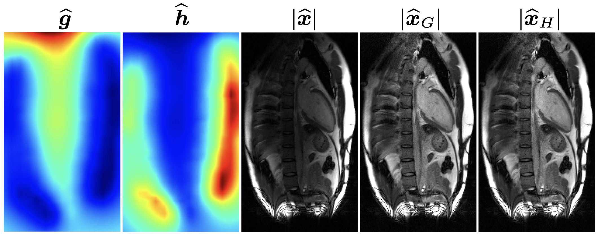

## Surface Coil Intensity Correction (SCC)

1. Create a new environment named SCC in conda and activate it:
   * `conda create --name SCC python=3.8`
   * `conda activate SCC`
   * `conda install jupyterlab`
   * `conda install ipykernel`
   * `python -m ipykernel install --user --name=SCC`
   

2. Clone the GitHub repository to your local workstation

3. Open `brightness_correction_demo.ipynb` in Anaconda, VS Code, etc.
   * go to the folder you just downloaded: `cd path_to_the_folder_you_just_downloaded`
   * run `jupyter notebook` in the terminal you open in 1 
   * Make sure the SCC environment is selected
   * Execute all cells in `brightness_correction_demo.ipynb`
   

## For installing the package content (optional)
Go to the path of the SCC folder and run the following command: `pip install -e`.

## Representative results

  
   
  <i>Figure 1: From left to right, correction map for the image, correction map for the sensitivity maps, magnitude of the uncorrected image, magnitude of the image corrected with the first correction map, the magnitude of the image where the sensitivity maps are corrected with the second correction map. A representative two-chamber view of the heart is shown.</i>

## Pulication
In preparation

   

